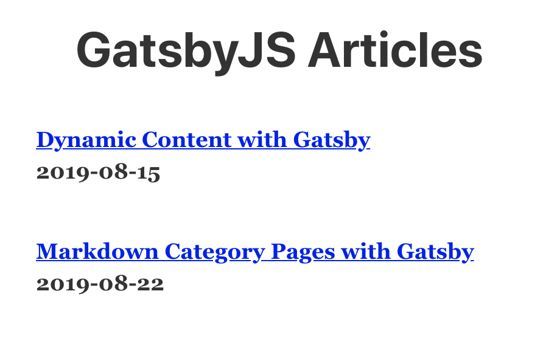

This article contains a strategy for creating category list pages from categories defined in a markdown article. There is an assumption of some basic knowledge of gatsby and that you already have some [article pages generated](https://www.gatsbyjs.org/tutorial/part-seven/#creating-pages) from markdown files.

Our end goal is to generate the pages **/category/GatsbyJS** and **/category/React** which both list links to any articles within the category. For example for a "GastbyJS" category we want to generate a list of articles



## Markdown Frontmatter

To categorize our articles we are going to include a property in our frontmatter called **categories**, which is an array of categories that the article belongs to

```yaml
# src/articles/gatsby-categories.md
---
title: Markdown Category Pages with Gatsby
slug: gatsby-categories
categories: ["GatsbyJS", "React"]
date: "2019-08-01"
---
This strategy is for creating category list pages from categories defined in markdown frontmatter...
```

We are going to skip over the generating of the article pages themselves, the [Gatsby tutorials](https://www.gatsbyjs.org/tutorial/part-seven/#creating-pages) have a section on that or you can copy from the CodeSandbox embed at the bottom of this article.

## Gatsby Configuration

In the **gatsby-config.js** file you should have **gatsby-transformer-remark** included in your plugins with **gatsby-source-filesystem** pointing to the location of your markdown files

```js
// gatsby-config.js
module.exports = {
  plugins: [
    {
      resolve: `gatsby-source-filesystem`,
      options: {
        name: `articles`,
        path: `${__dirname}/src/articles`,
      },
    },
    `gatsby-transformer-remark`,
  ],
}
```

All of our articles will go into the _src/articles_ directory with the frontmatter format including _title_, _slug_, _categories_ and _date_.

Next in the **gatsby-node.js** file is where we want to build the pages. First, let's create a utility function that is going to do most of the work, it iterates over all of our articles and builds an array that only contains one of each category

```js
// gatsby-node.js
function dedupeCategories(allMarkdownRemark) {
  const uniqueCategories = new Set()
  // Iterate over all articles
  allMarkdownRemark.edges.forEach(({ node }) => {
    // Iterate over each category in an article
    node.frontmatter.categories.forEach(category => {
      uniqueCategories.add(category)
    })
  })
  // Create new array with duplicates removed
  return Array.from(uniqueCategories)
}
```

Then we are going to make use of the **dedupeCategories** function to generate our category pages

```js
// gatsby-node.js
exports.createPages = async ({ graphql, actions, reporter }) => {
  const { createPage } = actions

  // Query markdown files including data from frontmatter
  const {
    data: { allMarkdownRemark },
  } = await graphql(`
    query {
      allMarkdownRemark {
        edges {
          node {
            frontmatter {
              title
              slug
              categories
              date
            }
            excerpt
          }
        }
      }
    }
  `)

  // Create array of every category without duplicates
  const dedupedCategories = dedupeCategories(allMarkdownRemark)

  // Iterate over categories and create page for each
  dedupedCategories.forEach(category => {
    reporter.info(`Creating page: category/${category}`)
    createPage({
      path: `category/${category}`,
      component: require.resolve("./src/templates/CategoryList.js"),
      // Create props for our CategoryList.js component
      context: {
        category,
        articleList: {
          // Create an array of articles in this category
          edges: allMarkdownRemark.edges.filter(({ node }) => {
            return node.frontmatter.categories.includes(category)
          }),
        },
      },
    })
  })
}
```

In **src/templates/CategoryList.js** that we referenced in the **createPage** function call we can use the context properties in our CategoryList props to generate the list of links to our articles

```js
import React from "react"
import { Link } from "gatsby"

const CategoryList = ({ pageContext: { category, articleList } }) => (
  <div>
    <h1>{category}</h1>
    <ul>
      {articleList.edges.map(({ node }) => {
        return (
          <li>
            <Link to={`article/${node.frontmatter.slug}`}>
              {node.frontmatter.title} - {node.frontmatter.date}
            </Link>
          </li>
        )
      })}
    </ul>
  </div>
)

export default CategoryList
```

There you have it! we have category list pages being generated at build time in gatsby. Next up you just need to figure out how you want to link users to those category pages, maybe each post has a tag that the user can click on or your home page has a list of categories. Heres a full example on CodeSandbox with both the category list and article pages generated, with the homepage linking to each category

<!-- TODO: Get oembed plugin working for codesandbox -->
<iframe src="https://codesandbox.io/embed/category-pages-with-gatsby-ugj4m?fontsize=14" title="Category Pages with Gatsby" allow="geolocation; microphone; camera; midi; vr; accelerometer; gyroscope; payment; ambient-light-sensor; encrypted-media" style="width:100%; height:500px; border:0; border-radius: 4px; overflow:hidden; margin-top: 50px" sandbox="allow-modals allow-forms allow-popups allow-scripts allow-same-origin"></iframe>
