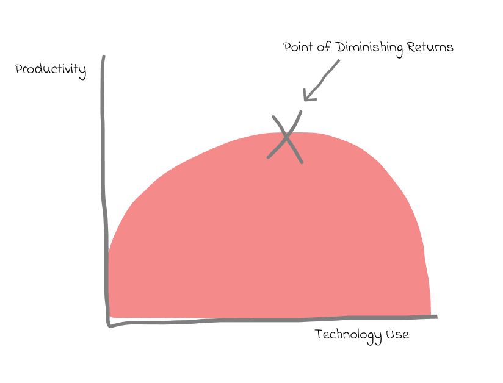
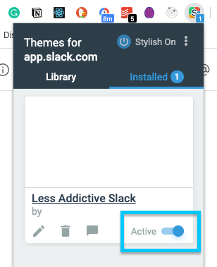
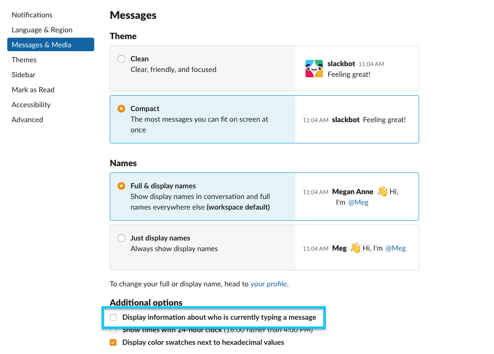
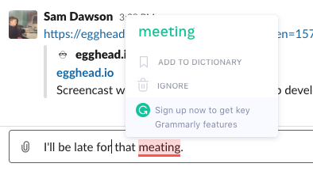

To some extent, it is the design of tools like slack that makes them addictive. To avoid the point of diminishing returns with slack usage, we can nudge ourselves to become less addicted by making some tweaks.



If you use slack in the [browser](https://app.slack.com/) you can augment your experience with extensions. With tools like [Stylish](https://chrome.google.com/webstore/detail/stylish-custom-themes-for/fjnbnpbmkenffdnngjfgmeleoegfcffe) you can inject your own CSS into the page.

## CSS Tweaks

Reactions make slack more addictive than I would like. Often reactions don't add much to the experience either, do I really need to know that 10 people reacted with 😂? (or maybe I'm just no fun?)

To turn off the _viewing_ of reactions this CSS does the trick. It won't stop you from reacting to posts from others.

```css
.c-reaction--light,
.c-reaction_add {
  display: none;
}
```

On occasions you do need to check reactions, for example when using them to vote on something. You can toggle off your styling.



I think most of the time @ mentions draw more attention to messages than needed. We can dial down their noisiness with this styling tweak that removes the yellow background and bold font weight.

```css
.c-mrkdwn__broadcast--mention,
.c-member_slug--mention,
.c-member_slug--link {
  background-color: transparent;
  font-weight: normal;
}
```

## Preferences Tweaks

More generally turning off notifications can prevent you from checking slack so often and turning off information about who is typing a message can help avoid the anticipation of waiting for someone to craft their perfect message.



## Other Extensions

When using slack in the browser you can also make use of [Grammarly](https://chrome.google.com/webstore/detail/grammarly-for-chrome/kbfnbcaeplbcioakkpcpgfkobkghlhen). If you're ok with sending all of your keystrokes to a third-party that is.



Slack is releasing a redesign soon, the CSS classes mentioned in this article may need some tweaking once that arrives.

## Additional Resources

[The productivity pit: how Slack is ruining work](https://www.vox.com/recode/2019/5/1/18511575/productivity-slack-google-microsoft-facebook)

[Digital Minimalism Book](https://www.calnewport.com/books/digital-minimalism/)
