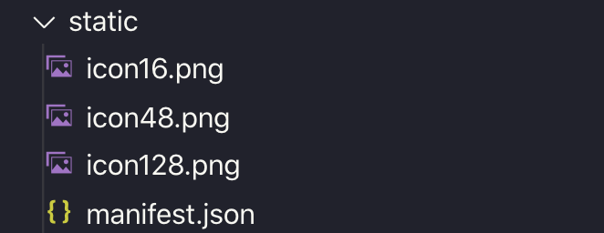

This article is not a tutorial on how to build a chrome extension from scratch. Maybe you know how to make an extension with vanilla JS and now want to build it with your favorite frontend library. We are going to follow along the process I used to build [Hippocampus](https://github.com/Samic8/Hippocampus).

My first attempt was using vanilla JS, quickly I missed the convenience of React when building simple form elements and reacting to changes in data.

My extension needed three "entries" (stand-alone files/apps) options.html, popup.html and content.js.

I gave [parcel](https://parceljs.org/) a go and it seemed like a perfect fit. I could run

```bash
parcel build src/content.tsx src/options.html src/popup.html
```

and it would generate the three files I needed. My extension was written in typescript and react, but parcel will support whatever flavor of JS you want to use.

## Static Files

Chrome extensions need a manifest.json and some images for the extension's icon. I used a parcel plugin [parcel-plugin-static-files-copy](https://github.com/elwin013/parcel-plugin-static-files-copy) for these files.

```bash
yarn add parcel-plugin-static-files-copy
```

Then in <app root>/static directory I added the mainfest.json and png icons.



When running a parcel command all of these static assets are copied across to the dist directory.

## HTML files

The files that a chrome extension requires to be an HTML file (popup.html, options.html) you will want to create a basic HTML file.

```html
<!-- options.html -->
<!DOCTYPE html>
<html>
  <head>
    <title>Hippocampus Settings</title>
    <meta charset="utf-8" />
  </head>
  <body>
    <div id="app"></div>
    <script src="options.tsx"></script>
  </body>
</html>
```

and accompany it with your JS file, in this case, a typescript/react file, but once again use your own JS flavor.

```js
// options.tsx
import * as React from "react"
import * as ReactDOM from "react-dom"

function App() {
  return (
    <form>
      <h1>Options</h1>
      {/* options goes here... */}
    </form>
  )
}

const mountNode = document.getElementById("app")
ReactDOM.render(<App />, mountNode)
```

## JS files

This might be react and content.js specific. To add a react rendered element into the DOM of the current webpage I needed to first create an element, append it to the body and then render react on that appended element.

```js
// content.tsx
import * as React from "react"
import * as ReactDOM from "react-dom"

function App() {
  return (
    <section style={{ position: "fixed" }}>
      <h1>Logo:</h1>
      <input type="checkbox" />
    </section>
  )
}

var newNode = document.createElement("div")
document.body.appendChild(newNode)
ReactDOM.render(<Content />, newNode)
```

I wanted to add a position fixed element to the page, instead of modifying or adding to an existing element. So this might not be exactly what you will need to with your app, good luck!

## Building files for publishing

When ready to publish you will want to run

```bash
parcel build src/content.tsx src/options.html src/popup.html
```

which will create a dist directory with the built files.

Next, you just need to create **.zip** **file** of the dist directory and your chrome extension should be ready to publish to the chrome store.

When developing the chrome extension you can use the command

```bash
parcel src/content.tsx src/options.html src/popup.html
```

which will watch your files and build the dist directory. Make sure you use **parcel build** when publishing and not the dev mode.

Before landing on parcel as a solution I tried to also use "create react app", the pain point with this was that it is not easy to have multiple "entry files" which we have already seen parcel did with ease.

You can check out the [source code of Hippocampus](https://github.com/Samic8/Hippocampus) for more details into how everything came together for this extension.
