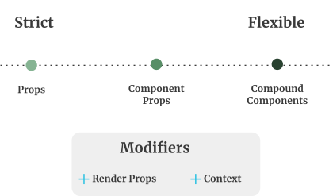

This article will go over some component API design patterns at a high level and without getting into implementation details of specific components.

For our case, a "component API" in React is the props that a component accepts. When we design components at the right level of flexibility we reduce future refactors, increase code reuse and potentially increase UI consistency.

All components exist somewhere on a flexibility spectrum.



## Picking the right level of flexibility

For components that you know, won't be used frequently, start with stricter flexibility and accept the price of having to refactor to change it to be more flexible once you know you need it.

For components that you know will be used many times opt for more flexible, to begin with. If you want to lock down specific usages you could create a variant for that case (see base/variants below).

But overall the practice that will get the best results is to **talk first, code later.** Have a written plan for the props of the component that you can show other coders or designers and see what they think.

## Flexibility Design Patterns

### **Strict Props**

Involves having well defined types of props.

    <Select options={[1, 2, 3]} selectedOption={1} onSelectedOptionChange={() => /* ... */}/>

In this case the _options_ prop is array of values and _selectedOption_ is a single value.

**Advantages**

Best for consistency, this design provides a limited number of ways to use the component.

**Disadvantages**

Can become complex when the component has too many variations with lots of props.

**When to increase the flexibility?**

When your component has lots of props and even worse when most of them are boolean flags e.g "shouldShowGroups" "shouldHaveBoldHeading".
Too many flags can make extending the component hard in the future because you now need to account for each of those flags functionality changes and make sure you don't break them. See **Base/Variants** for ideas on how to avoid excessive flags.

### **Component as Props**

This API design has a few different flavours.

**Slots**: The ability to include JSX within a particular component. The base component then places that included JSX at a particular spot in its component tree.

```js
<Multiselect
  header={<h1>Numbers</h1>}
  options={
    <ul>
      <li>One</li>
      <li>Two</li>
    </ul>
  }
/>
```

**Structured Data:** The component accepts a data structure for a particular prop that has to conform to a specific shape, which includes a component reference (or JSX) somewhere in that structure.

```js
// Component Reference
<Multiselect
  options={[
    { title: 1, component: MyOption, text: 'One',  }
  ]}
/>

// JSX
<Multiselect
  options={[
    { value: 1, display: <MyOption>One</MyOption> }
  ]}
/>
```

**Advantages**

More flexibility then strict props. In this example, we could change what the multi-select options looked like, but we could not introduce a new concept like groupings without modifying the base components code.

**Disadvantages**

A props data structure for the component might become complex (with lots of nesting) if it's trying to suit too many use cases.

### **Compound Components**

Involves defining specific components to be used with a **base** component passed to it as props (including children).

```js
<Multiselect
  selectedValues={[1, 2]}
  onSelectedValuesChange={newValues => /* ... */}/>
  <Option optionValue={1}>One</Option>
  <Group header="The best numbers">
    <Option optionValue={2}>Two</Option>
    <Option optionValue={3}>Three</Option>
  </Group>
</Multiselect>
```

In this case, the _Multiselect_ is the **base** component while the _Option_ and _Group_ components are the composable parts. More [in-depth introduction here](https://www.samdawson.dev/article/compound-components-what-why-when).

**Advantages**

The high flexibility of this pattern allows the coder to make variations without having to extend the base component.

**Disadvantages**

The high flexibility can be a disadvantage for consistency. Allowing coders to use the component in a very different way than intended might go against the reason for building the component in the first place (consistency).

On a similar note, it's easy to break design guidelines. For example putting groups before un-grouped options, if that was a design guideline of yours.

## **Base/Variants (composed components)**

This is mainly just the way you normally would build components, by composing other components to make a new component. Deciding to use a base/variant pattern would just be a way of formalize this for a particular component series.

It can be combined with any of the mentioned flexibility patterns.

```js
// Base component
<Multiselect />

// Variation
<MultiselectWithSearch />
```

You may need to implement a more flexible API for the base component so it can be open to extension through variants.

## Flexibility Modifiers

Some React specific patterns can help designing more flexible APIs. They facility _parent to child_ and _child to parent_ communication. The way you use these factors into how flexible and potentially more complex components can become, so they are worth considering when designing a components API.

You can read about how these work in the react documentation. Im not going to go into depth about what they are here.

### Context

Can share data for parent to child communication

Can share functions for child to parent communication. For example, when an _Option_ component is clicked it can communicate with the base _Multiselect_ component that this happened, through the use of a callback function.

[Documentation](https://reactjs.org/docs/context.html)

### Render Props

Render Props is a little less magical than context, though it requires more wiring up code to be written on each usage.

Can share data for parent to child communication.

Can share functions for child to parent communication.

[Documentation](https://reactjs.org/docs/render-props.html)
