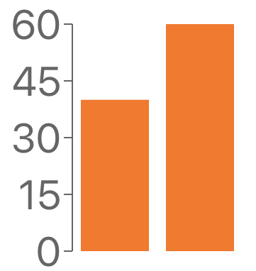

This article a walk-through of testing a React Bar Graph with [Jest](https://jestjs.io/) and [React Testing Library](https://testing-library.com/docs/react-testing-library/intro). The style of tests documented here could also be called integration tests.

The gold standard for UI testing is to test user _behavior_ instead of code _implementation_ because it makes the code flexible and ensures the user critical functionality works! Unfortunately with SVG graphs implementation testing comes with the territory, because the graph is _implemented_ as an SVG. That's OK, the trade-off is that we create robust graph code that will withstand time.

Like all code, graphs can become complex over time as more and more features are piled on. Graphs also tend to be reused many times for different data sets so they usually succumb to many flags--with props like "shouldShowAverage" which adds a line to a bar graph.

You've heard it a million times "don't reinvent the wheel". There are great open-source libraries for graphs but eventually, you might out-grow them. Writing great tests gives you the flexibility to swap out libraries or write your own with lower-level libraries like [D3](https://d3js.org/) in the future.

## Writing tests for a bar graph

Let's take my own advice and start with a charting library. We are going to be using [recharts](https://github.com/recharts/recharts) to create a simple bar chart. For the future ability to swap out libraries, we are also going to wrap the chart in our own custom component.

GITHUB-EMBED https://github.com/Samic8/robust-ui-examples/blob/576e75028d462f01416f80f8bb0fc7699d57ea25/src/components/BarGraph/index.js javascript GITHUB-EMBED

How the rechart components are used within our `jsx,BarChart` is not important for the purposes of this article. It's important that the props include width and height so the bars rendered in our tests are consistent sizes.

We always need setup code in our tests, heres some:

GITHUB-EMBED https://github.com/Samic8/robust-ui-examples/blob/576e75028d462f01416f80f8bb0fc7699d57ea25/src/components/BarGraph/BarGraph.test.js javascript 1-18,48-49 GITHUB-EMBED

It's not ideal that we need to create the graphContainer variable, we will see why it's needed in a moment.

Visually--although we won't see it in these tests--the bar graph setup in the `js,beforeEach()` would look like:



First up let's get the bars under tests. Jest's `js,test.each()` allows us to write tabular data which pairs nicely with graphs.

GITHUB-EMBED https://github.com/Samic8/robust-ui-examples/blob/576e75028d462f01416f80f8bb0fc7699d57ea25/src/components/BarGraph/BarGraph.test.js javascript 5-6,20-34,48-49 GITHUB-EMBED

The Recharts bars are not immediately rendered due to animations so we need to `js,wait()` a few seconds for the `js,expect()` assertions to pass.

Having to use `js,querySelector()` or `js,querySelectorAll()` is a red flag that your testing implementation, but as we already have discussed it's a necessary evil when testing SVG graphs.

Notice how we are not trying to capture every attribute and making use of `js,getAttribute()`, this allows the code some flexibility to change.

Next, let's add some tests for the y-axis value markers:

GITHUB-EMBED https://github.com/Samic8/robust-ui-examples/blob/576e75028d462f01416f80f8bb0fc7699d57ea25/src/components/BarGraph/BarGraph.test.js javascript 5-6,36-47,48-49 GITHUB-EMBED

For this test we have introduced another implementation detail--like the `js,wait()` previously--because the `js,parentNode` contains the x and y attributes. Again, it's not ideal but we get to have solid tests for the graph.

This second test is more in line with the [Testing Library philosophy](https://testing-library.com/docs/intro), but we do lose points for the `parentNode` usage.

We also made use of [screen](https://kentcdodds.com/blog/common-mistakes-with-react-testing-library#not-using-screen) which makes tests simpler as we don't have to worry about destructing or scoping variables, which was not available in the first test as we needed access to the `container` element.

## Snapshots

It's worth considering Jests [snapshot testing tool](/article/the-snapshot-testing-tool) `js,toMatchSnapshot()`

```javascript
expect(textNode).toMatchSnapshot()
```

This further nudges us in the direction of testing _implementation_ (not good). It's worth considering if the attributes of the element are minimal and you can accurately describe what your testing in the test description. The saved snapshot from the previous assertions creates the output:

```javascript
exports[
  `BarGraph given two data points at a particular size displays 15 in the correct position 1`
] = `
<text
  class="recharts-text recharts-cartesian-axis-tick-value"
  fill="#666"
  height="960"
  stroke="none"
  text-anchor="end"
  width="60"
  x="72"
  y="740"
>
  <tspan
    dy="0.355em"
    x="72"
  >
    15
  </tspan>
</text>
`
```

I don't know how to describe all of those attributes in a description, so it's not a good usage of snapshot testing.

## What about TDD (Test Driven Development)?

Yeah about that... it's hard with graphs, especially as showcased in this example when using an external library. I recommend first writing (or including a library) the code for a section of a graph (e.g the bars), making sure it visually looks right, then writing tests.

You can write test with empty values:

```javascript
const textNode = screen.getByText(value).parentNode
expect(textNode.getAttribute("y")).toBe("")
expect(textNode.getAttribute("x")).toBe("")
```

The tests will error when run:

```
BarGraph › given two data points at a particular size › displays 15 in the correct position

    expect(received).toBe(expected) // Object.is equality

    Expected: ""
    Received: "740"
```

Then copy and paste the correct values.

This is a manual version of what snapshot testing, so you could just use that if you prefer. Instead of capturing the entire element, you can use it to capture specific data points:

```javascript
const textNode = screen.getByText(value).parentNode
expect(textNode.getAttribute("y")).toMatchSnapshot()
expect(textNode.getAttribute("x")).toMatchSnapshot()
```

## Conclusion

Although testing _implementation_ goes against Testing Libraries philosophy it's worth being a bit awkward to make your graph code robust and future proof. SVG graphs are [not particularly accessible](https://tink.uk/accessible-svg-line-graphs/) themselves, so it's hard to query by user-accessible features, which is what Testing Library wants you to do.

On swapping out libraries as mentioned earlier: It's never going to be as simple as swapping libraries and the tests all pass because we are testing implementation (the SVG), but that's ok it's an intentional decision.

### Resources

- [Full example bar graph test code](https://github.com/Samic8/robust-ui-examples/blob/576e75028d462f01416f80f8bb0fc7699d57ea25/src/components/BarGraph/BarGraph.test.js)
- [Attempting accessible SVG graphs](https://tink.uk/accessible-svg-line-graphs/)
- [My thoughts on snapshot testing](/article/the-snapshot-testing-tool)
- [Using screen for neater tests](https://kentcdodds.com/blog/common-mistakes-with-react-testing-library#not-using-screen)

### Upcoming Related Articles

- Visually testing SVG graphs to complement unit tests
