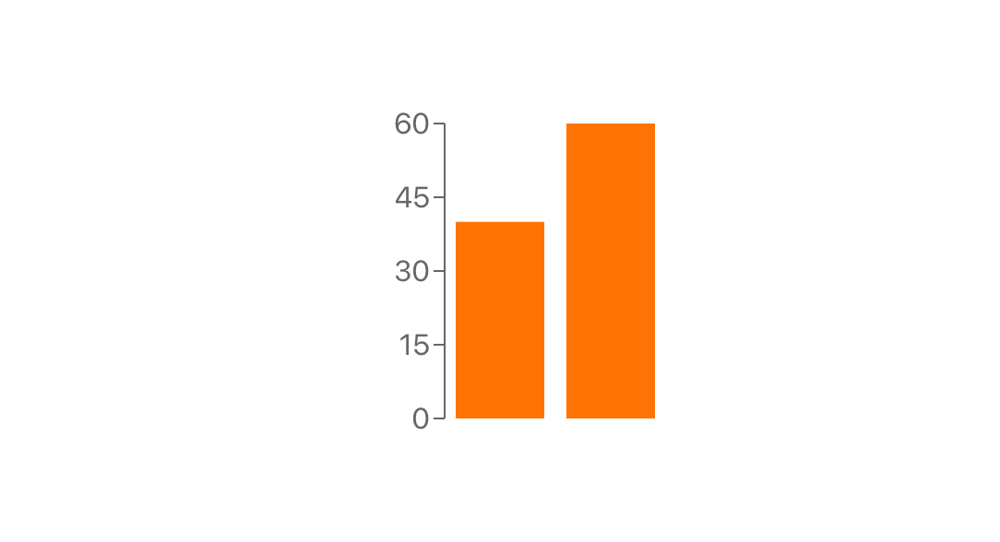

Outline
This article is walk-through an example of how to test a React bar graph component with [Jest](https://jestjs.io/) and [React Testing Library](https://testing-library.com/docs/react-testing-library/intro).

Hero
The gold standard for component testing is to test user behaviour instead of code implementation. Unfortunately with SVG graphs if we want to do low level tests on the individual components implementation testing comes with the territory, because the graph is _implemented_ as an SVG. That's OK, the trade-off is that we create robust graph code that will withstand time.

Villain
Like all code, graphs can become complex over time as more and more features get added. Graphs also tend to be reused many times for different data sets, and they usually succumb to many flags -- with props like "shouldShowAverage" which adds a line to a bar graph.

Solution
You've heard it a million times -- don't reinvent the wheel -- this is especially relevant with graphs. There are great open source libraries out there for graphs, but eventually you might out grown them and need something more custom. Writing solid tests gives you the flexibility to swap out libraries or write your own with lower level libraries like [D3](https://d3js.org/) in the future.

Because we are testing implementation -- the SVG -- it's never going to be as simple as swapping libraries and the tests all pass. Thats a trade off we are intentionally making, as we will see in the following example we will write tests with that in mind. (todo elaborate?)

Let's take my own advice and start with a charting library. We are going to be using [recharts](https://github.com/recharts/recharts) to create a simple bar chart. For future flexibility we are also going to wrap the chart in our own custom component, everywhere that uses this type of graph will use this component.

GITHUB-EMBED https://github.com/Samic8/robust-ui-examples/blob/dbd6fafbc14b0ff7524567db15de8374f787be78/src/components/BarGraph/index.js javascript GITHUB-EMBED

Its important that the props include width and height so that our tests can hard-code them. How the rechart components are used within our `BarChart` component are not important for the purposes of this article.

We always need setup code in our tests, heres some:

GITHUB-EMBED https://github.com/Samic8/robust-ui-examples/blob/9372addf01d65620ea8a62c286041141887e66fd/src/components/BarGraph/BarGraph.test.js javascript 1-18,47-49 GITHUB-EMBED

It's not ideal that we need to create the graphContainer variable, we will see why it's needed in a moment.

Visually -- although we won't see it in these tests -- the bar graph with the variables we have set up would look like this:

First up let's get bars under tests. Jests test.each is super handing for testing graphs, we can display the data we want to test for the bars in a tabular format.

GITHUB-EMBED https://github.com/Samic8/robust-ui-examples/blob/9372addf01d65620ea8a62c286041141887e66fd/src/components/BarGraph/BarGraph.test.js javascript 21-34 GITHUB-EMBED

Recharts bars are not immediately rendered so we need to do `await wait` which can cause delayed test failures because Jest will wait a few moments for the `expect` assertions to pass, on successful test runs it won't cause much of a slow down though.

Here we also make use of the `graphContainer` element that we set earlier. As you will see in the next test, we will use `screen` instead. [Screen](https://kentcdodds.com/blog/common-mistakes-with-react-testing-library#not-using-screen) makes tests simpler as we don't have to worry about destructing or scoping variables, but it's not available when you need to make use of `querySelector`. Having to use `querySelector` or `querySelector` in your tests should be a red flag that your testing implementation, but as we already discussed it's a necessary evil when testing SVG graphs.

We are using getAttribute to test specifics of the bars. Notice how we are not trying to capture every attribute, this allows the implementation some flexibility to change without our tests breaking.

Next let's add some tests for the "ticks" which are the value marks to the left of the bar graph.

GITHUB-EMBED https://github.com/Samic8/robust-ui-examples/blob/9372addf01d65620ea8a62c286041141887e66fd/src/components/BarGraph/BarGraph.test.js javascript 36-46 GITHUB-EMBED

Like the bars we have just choose a few key aspects of the ticks we want to test. We can also make use of `screen` because we are querying the elements in a user accessible way (not implementation), which the [Testing Library](https://testing-library.com/docs/intro) philosophy approves of. Just because we break the rules of Testing Library once, we don't have to for all of our tests.

Hard coding the class for the rectangles is not ideal but its not

TODO how to make graph auto size?
