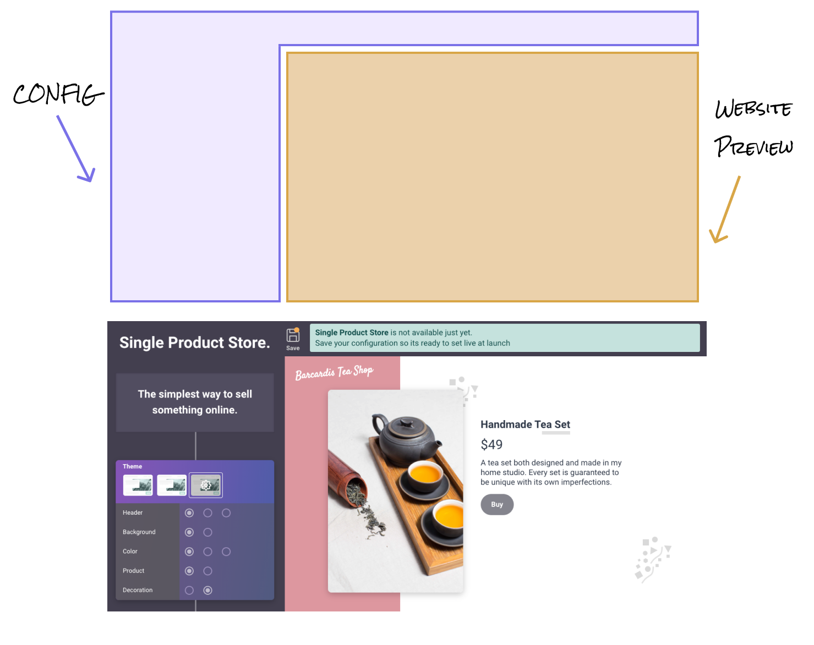

This is a solution for implementing color themes with [tailwind](https://tailwindcss.com/). It makes use of CSS variables which are great providing that you don't need to [support IE11](https://caniuse.com/#feat=css-variables).

```js
// tailwind.config.js
module.exports = {
  important: true,
  theme: {
    colors: {
      teal: {
        100: "var(--color-teal-100)",
        200: "var(--color-teal-200)",
        // and so on...
      },
    },
  },
}
```

Those color vars that are referenced in the config file then need to be created in CSS. Yeah so we have to write some CSS, which you might want to avoid when doing the tailwind utility class approach but I think of defining variables as configuration.

```css
:root {
  --color-teal-100: #55d3b8;
  --color-teal-200: #2c947e;
}

.funky-theme {
  --color-teal-100: #80f7dd;
  --color-teal-200: #5dd6bc;
}
```

Anything under root would be your "default" theme. When you want to apply the "funky-theme" you include that class at the top-level element that contains all of the elements you want to theme (this could be the body or a small section of the page).

```html
<body>
  <div>Pretty default themed in here<div>
  <section class="funky-theme">All funky themed in here</section>
</body>
```

Thats it!

## Primary, Secondary etc approach

Now if you want to instead want to create your theme with primary (and secondary etc) colors you can do that with some small differences in the config.

```js
// tailwind.config.js
module.exports = {
  important: true,
  theme: {
    colors: {
      primary: "var(--color-primary)",
      secondary: "var(--color-secondary)",
      // and so on...
    },
  },
}
```

```css
:root {
  --color-primary: theme("colors.teal.100");
  --color-secondary: theme("colors.yellow.500");
}

.funky-theme {
  --color-primary: theme("colors.red.800");
  --color-secondary: theme("colors.green.500");
}
```

Most likely with theming (e.g dark theme) this approach is going to be more useful. You also get to maintain your colors defined in the tailwind config and can reference them through the "theme" function.

## A real-world example

I used this pattern for the theming on a ["website builder" app](https://singleproduct.store/) where I wanted to use tailwind both for the "configuration" section and the "website preview" sections of the page.

I wanted each section to be independent so that the built websites colors didn't get mixed up with the branding colors for the main application.



Similar to the examples earlier in the post I used both a :root theme and a class selector

```html
<body>
  <section>
    <h1>Single Product Store</h1>
    <!-- This uses the default :root color theme -->
  </section>
  <section class="website-preview">
    <h1>Barcardis Tea Shop</h1>
    <!-- This uses "website-preview" color theme -->
  </section>
</body>
```

Let me know of any other approaches you have come up with for tailwind
theming maybe there is a sweet tailwind plugin that abstracts some of the class
creation away, or you have come up with a different approach altogether.
