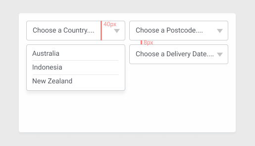

A magic number is a number or value in code that does not have an explicit meaning.

```css
.select-button {
    height: 40px;
}
```

In CSS maybe we don't have to be too strict and not every number usage needs to be a variable. But I think the more we can move towards using variables to represent meaning behind the numbers in our CSS the more maintainable our code will be.

One problem that using variables can help us solve is keeping values consistent.
```css
:root {
    --select-button-height: 40px;
}

.select-button {
    height: var(--select-group-height);
}

```
This is the lowest level of variable usage, which can use as building block for explicit calculations. Lets walk through an example of using variables for calculations so that we can avoid magic numbers.

This is the components we will be building, a custom select since we decided not to go with the browser default. We have opened up our design tool of choice and started doing some measurements.


Here is some HTML that we will be working with.

```html
<div class="select-group">
    <div class="select-group">
        <div class="select-button">
            Choose a Country...
            <svg><!-- triangle stuff here --></svg>
        </div>
        <ul class="select-options">
            <li>Australia</li>
            <li>Indonesia</li>
            <li>New Zealand</li>
        </ul>
    </div>
    <!-- Other selects... -->
</div>
```

On first pass we might code up some CSS like this, which achieves the desired layout.

```css
.select-group {
    display: grid;
    grid-template-columns: 1fr 1fr;
    grid-gap: 8px;
}

.select-group {
    position: relative;
}

.select-button {
    height: 40px;
}

.select-options {
    position: absolute;
    top: 48px;
}
```

But what happens when someone else changes the gap between the selects but forgets (or never knew, because it was not explicit) that the **select-options** is meant to have the same distance between the **select-button** and the **select-options** as the gap been the selects. When the gap is changed and the **top** position of the **select-options** is not updated we end up with an "out of sync" issue. 

To solve this we can be more explicit and calculate our calculated values.

```css
:root {
    --select-group-gap: 8px;
    --select-button-height: 40px;
}

.select-group {
    display: grid;
    grid-template-columns: 1fr 1fr;
    grid-gap: var(--select-group-gap);
}

.select-group {
    position: relative;
}

.select-button {
    height: var(--select-group-height);
}

.select-options {
    position: absolute;
    top: calc(var(--select-group-gap) + var(--select-group-height));
}
```

Now reading through the CSS it is explicit what the **select-options** positioning is based on.